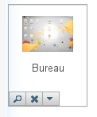

Item Picker
###########

.. php:namespace:: Nos

.. php:class:: Renderer_Item_Picker

    | Extends :php:class:`Nos\\Renderer`.
    | This renderer is used to pick a item.
    | It displays a thumbnail of the item with buttons to manage the selected item

Configuration
*************

.. php:attr:: model

	The model name

.. php:attr:: appdesk

	URL of the model appdesk.

.. php:attr:: size

	Size of the thumbnail. Default ``64``

.. php:attr:: texts

    Labels use for UI

        :empty: Label when no item selected. Default ``No item selected``.
        :add: Label of button to pick an item. Default ``Pick an item``.
        :edit: Label of button to pick another item. Default ``Pick another item``.
        :delete: Label of button to un-select item. Default ``Un-select this item``.

.. php:attr:: defaultThumbnail

    URL of the default thumbnail

Methods
*******

.. php:method:: renderer($renderer)

	:param Model $renderer:

	    Array the attributes.

	:return: The <input> tag with JavaScript to initialise it

	Displays a item picker renderer in a standalone manner.

Example
*******

Adding a page item picker in a CRUD form configuration:

.. code-block:: php

    <?php

    return array(
        'label' => __('Page:'),
        'renderer' => 'Nos\Renderer_Item_Picker',
        'renderer_options' => array(
            'model' => 'Nos\Page\Model_Page',
            'appdesk' => 'admin/noviusos_page/appdesk',
            'defaultThumbnail' => 'static/apps/noviusos_page/img/64/page.png',
            'texts' => array(
                'empty' => __('No page selected'),
                'add' => __('Pick a page'),
                'edit' => __('Pick another page'),
                'delete' => __('Un-select this page'),
            ),
        ),
    );
